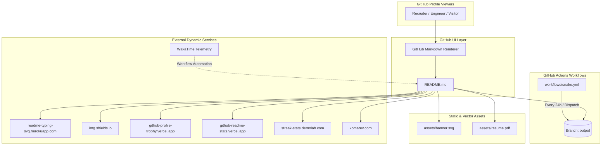

# Codebase Memory: profile-redesign

## Phase 1 — Repository Discovery

### Repository Overview
- **Project Name**: `profile-redesign` (Special Profile Repository for GitHub: `AadityaBhuree/AadityaBhuree`)
- **Owner / Identity**: Aditya Bhure (`AadityaBhuree`)
- **Repository Type**: Special GitHub Profile README Repository & Dynamic Automation Hub
- **Root Structure**:
  ```text
  profile-redesign/
  ├── .gemini/
  │   └── settings.json             # IDE and Agent configuration for codebase intelligence
  ├── .github/
  │   └── workflows/
  │       └── snake.yml             # GitHub Actions workflow generating contribution snake SVGs
  ├── assets/
  │   ├── banner.svg                # Custom SVG header banner with profile statistics & tags
  │   └── resume.pdf                # Candidate resume document
  ├── .gitignore                    # Standard git ignore patterns
  ├── memory.md                     # Codebase intelligence & architectural brain
  ├── README.md                     # GitHub Profile entry point & visual markdown document
  └── SETUP.md                      # Comprehensive integration & secret configuration guide
  ```

### Directory & Component Breakdown
- **`README.md`**: Main profile display rendered on GitHub user profile page. Integrates dynamic typing SVG banners, shields.io badges, CLI pseudo-terminal output, trophy widgets, project cards, GitHub stats/streak graphs, contribution snake animations, and WakaTime activity widgets.
- **`SETUP.md`**: Operational documentation covering setup of repository secrets (`WAKATIME_API_KEY`, `METRICS_TOKEN`), third-party services (WakaTime, lowlighter/metrics, Medium/Dev.to RSS feeds, Novatorem Spotify now-playing integration), and troubleshooting steps.
- **`assets/banner.svg`**: Handcrafted SVG vector banner (1280x315) featuring editorial typography, light background (#FAF9F5), accent lines (#D35B35), metric counters, and domain focus tags.
- **`assets/resume.pdf`**: Direct binary asset for recruiter access.
- **`.github/workflows/snake.yml`**: Scheduled CI workflow (runs daily at 00:00 UTC and on workflow_dispatch) utilizing `Platane/snk` to parse contribution activity and push dark/light SVGs to the `output` branch.

---

## Phase 2 — Technology Detection

| Layer | Technology | Details / Implementation |
|---|---|---|
| **Presentation / Markup** | GitHub Flavored Markdown (GFM) + HTML5 | Custom HTML `<div>`, `<table>`, `<picture>`, `<source>`, `<a>`, `<summary>`, `<details>` |
| **Vector & Graphics** | Scalable Vector Graphics (SVG) | Custom `banner.svg`, dynamic `Platane/snk` contribution grid, `readme-typing-svg` |
| **CI / CD Automation** | GitHub Actions | Ubuntu runner, `Platane/snk/svg-only@v3`, `crazy-max/ghaction-github-pages@v3.1.0` |
| **Dynamic Widgets / APIs** | Third-Party Serverless APIs | Shields.io, GitHub Readme Stats, GitHub Streak Stats, GitHub Profile Trophy, Komarev Views Counter, WakaTime API |
| **Configuration** | JSON / YAML | `.gemini/settings.json`, `.github/workflows/*.yml` |
| **Version Control** | Git & GitHub Pages / Orphan Branches | Deployment of generated assets to `output` branch |

---

## Phase 3 — Project Purpose Analysis

1. **Business Problem Solved**:
   Acts as a high-conversion, professional portfolio and personal brand landing page hosted directly on GitHub for Aditya Bhure. It communicates technical capability in AI/ML, Data Science, and Backend Engineering to FAANG recruiters, hiring managers, and open-source collaborators.
2. **Target Audience**:
   - Technical Recruiters & Talent Acquisition Specialists (seeking 2026 AI/ML & Backend Engineering Interns).
   - Engineering Managers & Senior Architects evaluating code quality, project complexity, and engineering discipline.
   - Open Source Developers and Community Collaborators.
3. **Major Features**:
   - **Hero Section**: Theme-aware typing SVG header with fast-scannable contact badges (Resume, LinkedIn, Email, Portfolio).
   - **CLI About Terminal**: Terminal-styled metadata block (`aditya info`, `aditya status`, `aditya bio`) establishing software engineering identity.
   - **Curated Tech Stack Grid**: Badge hierarchy separating Core Daily Drivers (FastAPI, PyTorch, Docker, PostgreSQL, Python) from specialized AI/ML, Backend/Infra, and Cloud tools.
   - **Featured Projects Matrix**: Two-column layout highlighting end-to-end production projects with direct repository links and tech tags.
   - **Real-Time Analytics & Streak Tracking**: Live commit streak, total stars, PRs, issue contributions, and animated snake graph.
   - **Automated Workflow Integrations**: WakaTime coding telemetry and RSS blog post auto-publishing.

---

## Phase 4 — Architecture Analysis

### Architectural Flowchart


---

## Phase 5 — Routing Intelligence

This is a single-surface repository mapped directly to `https://github.com/AadityaBhuree`.

### Asset & Outbound Navigation Routes:
| Asset / Link | Target URL / Destination | Purpose |
|---|---|---|
| **Banner Graphic** | `raw.githubusercontent.com/AadityaBhuree/.../assets/banner.svg` | Hero visual element |
| **Portfolio Tab** | `https://github.com/AadityaBhuree?tab=repositories` | Directs to public repository catalog |
| **Resume PDF** | `./assets/resume.pdf` | Direct access to candidate resume |
| **LinkedIn** | `https://www.linkedin.com/in/aditya-bhure-466638249` | Professional networking |
| **Direct Contact** | `mailto:aadityabhure03@gmail.com` | Instant interview/internship inquiries |
| **AI Task Manager** | `https://github.com/AadityaBhuree/AI-Task-Manager` | NLP & productivity project |
| **Car Valuation ML** | `https://github.com/AadityaBhuree/used-car-price-prediction` | FastAPI + React + Scikit-Learn project |
| **Hand Gesture CV** | `https://github.com/AadityaBhuree/-Hand-Gesture-Recognition-System-using-CNN-and-OpenCV-` | Real-time CNN Computer Vision project |
| **Paper Pilot** | `https://github.com/AadityaBhuree/Paper-Pilot` | LLM / PyTorch / Hugging Face paper assistant |
| **GoodBook** | `https://github.com/AadityaBhuree/Goodbook-Recommender` | Recommendation engine |
| **License Plate OCR**| `https://github.com/AadityaBhuree/Vehicle-hand-written-no-recognizer` | Computer Vision OCR project |

---

## Phase 6 — Frontend Analysis & Design System

### Layout & Component Anatomy
1. **Header Zone**:
   - Centered banner image with dark/light mode responsive typing SVG.
   - Action Badges (`for-the-badge` style) with official brand colors: Slate (#1E293B), Rose (#E11D48), LinkedIn (#0077B5), Sky Blue (#0EA5E9).
2. **Terminal Identity Block**:
   - Code block simulation (`aditya info --version`, `aditya status --internships`, `aditya bio`).
   - Bulleted summary of core competencies and academic credentials.
3. **Visual Proof & Trophies**:
   - `github-profile-trophy` with dual dark (`onedark`) and light (`flat`) color schemes.
4. **Skill Taxonomy Matrix**:
   - Two-tier badge hierarchy: Large `for-the-badge` for primary daily drivers; clean `flat-square` for ecosystem tools.
5. **Project Grid**:
   - 2x2 HTML table layout with card titles, project summaries, tech stack badges, and GitHub link pills.
   - Interactive `<details>` accordions for secondary projects.
6. **Telemetry & Analytics**:
   - Side-by-side flex layout (48% width each) for GitHub Stats and Streak widgets with borderless transparent cards.
   - Full-width contribution snake SVG.
   - WakaTime telemetry code block and RSS blog comment boundaries.

---

## Phase 7 — Automation & Backend Workflows

### Implemented Workflows
- **`snake.yml`**:
  - Triggers: Scheduled cron (`0 0 * * *`) + `workflow_dispatch`.
  - Actions: Executes `Platane/snk/svg-only@v3` with dual-palette outputs (Sky Blue / Slate colors), commits to `output` branch.

### Documented Expansion Workflows (in `SETUP.md`)
- **`metrics.yml`**: Lowlighter metrics engine generating complex commit/language distributions.
- **`blog-post-workflow.yml`**: `gautamkrishnar/blog-post-workflow` injecting RSS items into `README.md`.
- **`wakatime.yml`**: `athul/waka-readme` syncing telemetry into the WakaTime section.

---

## Phase 8 — Data Flow & Secret Security

### Secrets Inventory
| Secret Key | Required Scope | Usage |
|---|---|---|
| `METRICS_TOKEN` | Classic PAT (`repo`, `read:user`) | Fetches private/public stats for GitHub Metrics |
| `WAKATIME_API_KEY` | Read-only API Key | Fetches IDE active coding hours |
| `GITHUB_TOKEN` | Default ephemeral workflow token | Pushes snake SVGs to `output` branch |

### Execution Pipeline
```text
Cron Trigger / Push
    ↓
GitHub Actions Runner Spawns (Ubuntu-Latest)
    ↓
Auth via GITHUB_TOKEN / Secrets
    ↓
Fetch Data / Generate SVGs / Scrape Feeds
    ↓
Git Commit / Deploy to Branch / Update README
    ↓
Cache Invalidation & CDN Refresh (GitHub camo cache)
```

---

## Phase 9 — Performance & Reliability Considerations

1. **GitHub Camo Proxy & Asset Caching**:
   - GitHub proxies external images through `camo.githubusercontent.com`. Image URLs use cache headers.
2. **Theme Sensitivity (`prefers-color-scheme`)**:
   - SVG components utilize `<picture>` elements with media queries to dynamically swap between dark and light modes.
3. **Cold Start & Third-Party Outages**:
   - External widgets (Heroku, Vercel free tier) can experience cold starts or rate limits. Utilizing local SVGs generated via GitHub Actions (like the snake workflow) eliminates runtime latency.

---

## Phase 10 — Future Improvement Vectors

1. Add explicit automated workflows for `blog-post-workflow` and `wakatime` to `.github/workflows/`.
2. Upgrade `banner.svg` with high-DPI dark mode support (`@media (prefers-color-scheme: dark)`).
3. Implement interactive GitHub pinned repository cards with direct live demo preview URLs.
4. Establish unified semantic color tokens across all shields and SVGs (#0EA5E9 Sky Blue primary, #1E293B Slate secondary).
